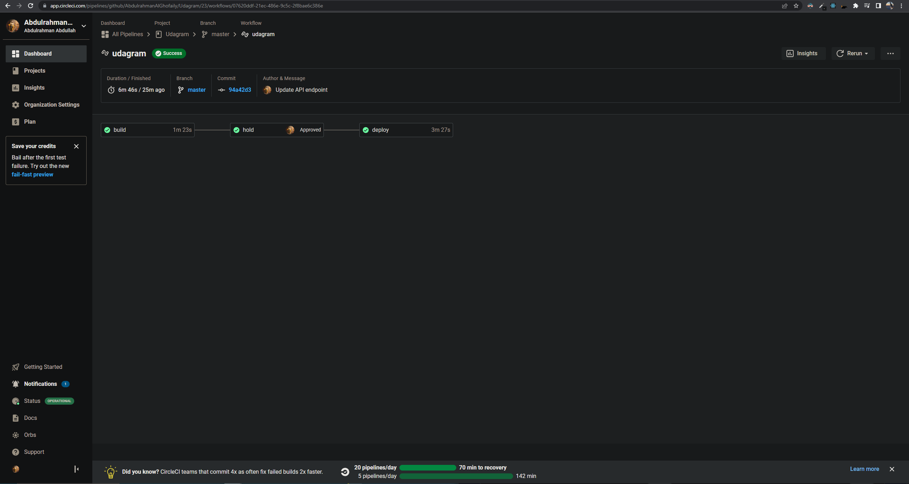
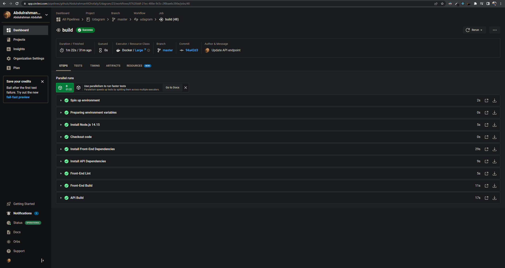
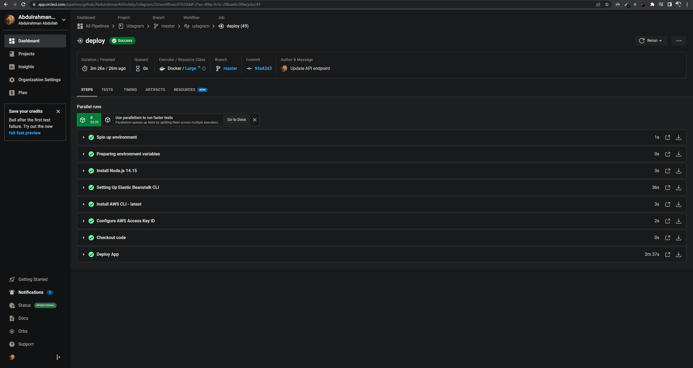
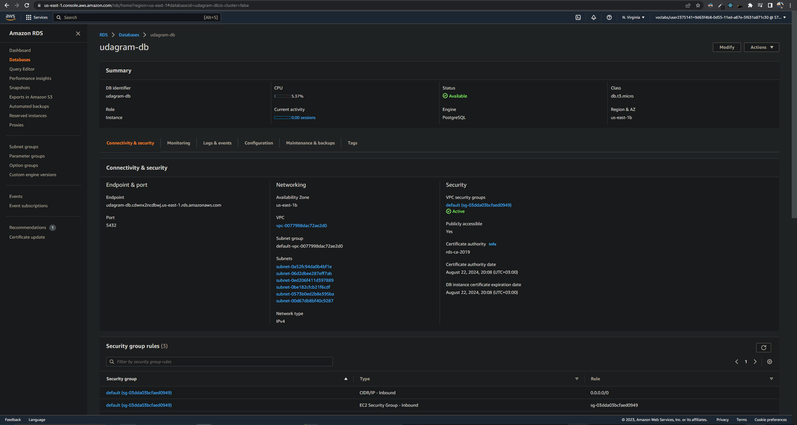
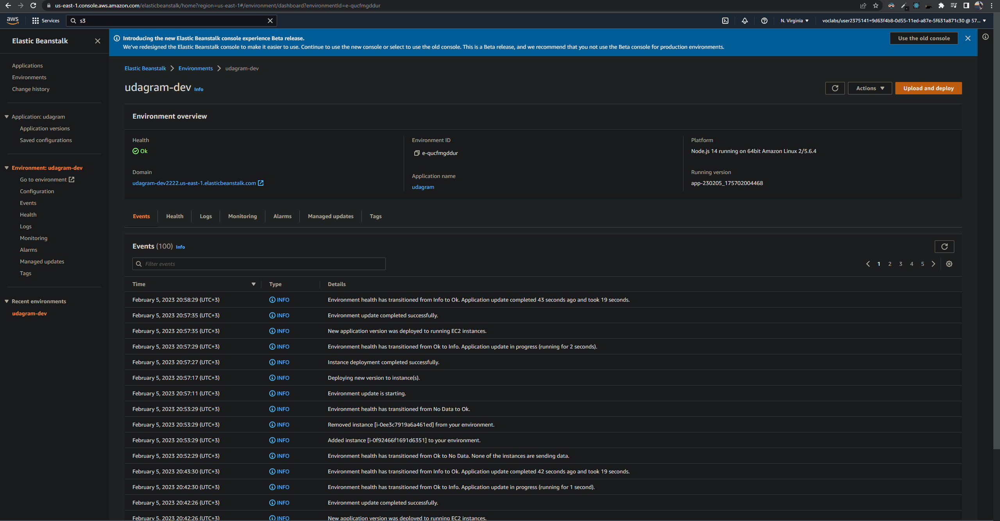
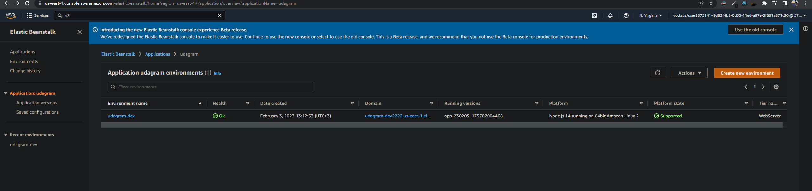

# Udagram Overview

This project is part of Udacity JavaScript Full-Stack. The goal of this project is to successfully deploy a full application Frontend and Backend to the AWS. Where you have to use the next AWS services:   
1- S3 service to host the Frontend of the application.  
2- Elastic Beanstalk service to host the Backend of the application.  
3- RDS service to host the postgres database.  
4- IAM to create AWS user with administration premissions.   
This repo is all about the results of the project.

## Working application

---

To accesss the application click here: [Udagram](http://project4-bucket-575123534936.s3-website-us-east-1.amazonaws.com/) (Note: this link will not be available after a while since the application hosted on a free account provided by Udacity)   
We start with a gif of the working application: 

 

## Screenshots

---

This section will include required screenshots.   
Last successful CircleCi build: 

 
Build phase: 

 
Deploy phase: 

 
AWS RDS for the database overview: 

 
AWS ElasticBeanstalk for the (backend) API deployment: 
 

 
AWS S3 for (frontend) web hosting: 

 
