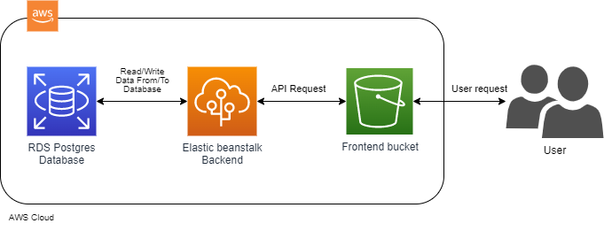

# Infrastructure description

To describe the infrastructure in a simple way I will use the next image as a reference:  
 
 
Everything starts with a user request, that request goes to first infrastructure service: 

- AWS S3, where the frontend of the app is deployed inside of a S3 bucket. 

After the frontend recieve the request it send back the frontend for the user (the GUI). Here where user could choose between two options, either register a new account or login. Depending on user action, we move to the next stage and our next service:

- AWS Elastic Beanstalk, where the backend application is deployed inside of an environment.

Here the application recives the api request from the application frontend, and take an action to either register or login a new account. it recieves the data and send it to the Database to either retrive data or store a new data. and it is where the last service takes place:

- AWS RDS, where the postgres database is hosted to store data.

And that's how the infrastructure works.
