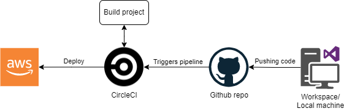

# Pipleline description

Here I would explain how the pipeline works in this project. I will use the next image as a reference: 
 
Everything starts with a change on the application code. After the change has been made and it is time to push the code to the Github repository. Pushing the code will trigger the pipelining in CircleCI (where the github project is connected). CircleCI looks for `.circleci/config.yml` file, then start executing the steps that are defined inside of it, from installing the dependencies in both frontend/backend, to building and deploying both on the AWS services. 
Sometimes `.circleci/config.yml` scripts are too long, so to simplify it we use package.json as a reference where pre-written scripts are.
